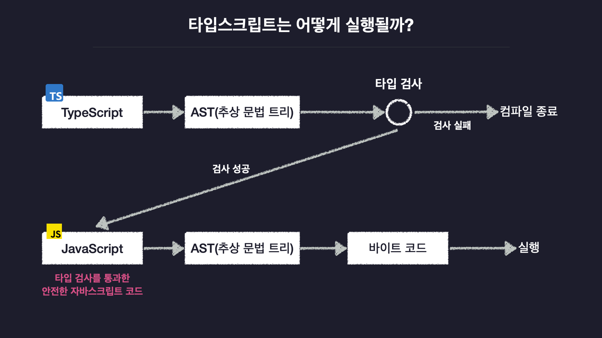

# TypeScript

## TypeScript란?

- JavaScript에 타입을 더 안전하게 사용할 수 있는 기능을 추가한 언어
- JavaScript의 확장판

```js
// JavaScript
let a = 1;
let b = 2;

console.log(a + b);
```

```ts
// TypeScript
let a: number = 1;
let b: number = 2;

console.log(a + b);
```

- 위와 같이 JavaScript에서 변수에 타입을 지정하는 문법을 추가하면 TypeScript 코드가 된다.

## TypeScript의 필요성

- JavaScript의 동적 타입 시스템과 Java의 정적 타입 시스템을 혼합한 듯한 타입 시스템을 가진다.
- 변수의 타입을 코드 실행 전에 결정하고 타입 오류가 없는지 프로그램 실행 전에 코드를 검사한다.
- 하지만 모든 변수에 직접 타입을 명시하지는 않으면, 변수의 담기는 초기값을 기준으로 타입을 추론한다.
- 이는 Java의 정적 타입 시스템처럼 오류를 검출할 수 있고, JavaScript의 동적타입시스템과 같은 유연성도 갖춘 언어임을 나타낸다.

## TypeScript의 동작 원리



- 다른 언어와 동일하게 TypeScript 코드를 AST(추상 문법 트리)로 변환한다.
- AST를 보고 코드 상에 **타입 오류가 없는지 검사**한다.
  - 만약 타입 오류가 있다면 컴파일이 중단된다.
- AST를 **JavaScript 코드로 변환**한다.
- 다른 언어들과 동일하게 컴파일 과정을 거친다. - AST로 변환 - 바이트 코드로 변환 - 컴파일 종료(실행)
  <br/>

**참고자료**

- https://ts.winterlood.com/7250edd7-a3fd-4662-b756-f11f927c73f2
